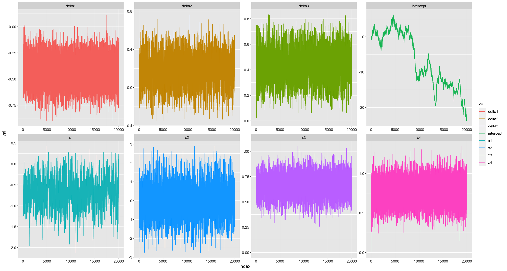
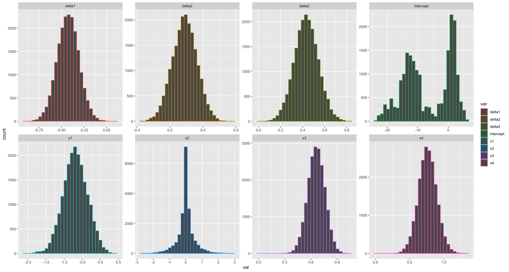
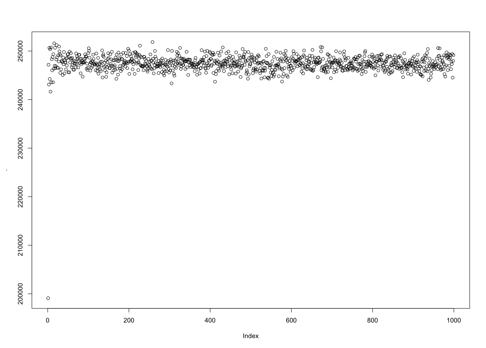
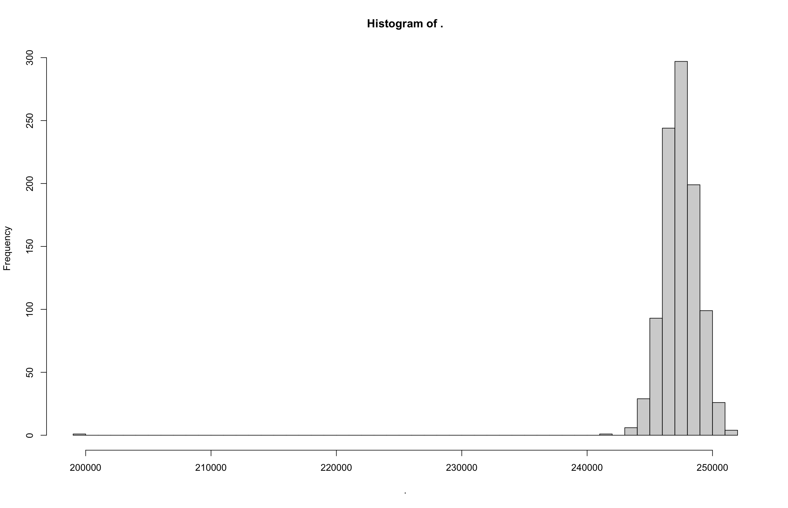

```{r}
library(tidyverse)
```


THIS IS THE DISUSSION PART ON INTERCEPT - WENHAO GOU  

# Discussion on MC chain:

We can see that, expected for the intercept, all other variables converged in very few steps. To investigate this problem in detail, several steps are considered: 

1. Create a very long chain:

One potential problem lied in this may due to the fact that we do not have a long-enough chain for this variable. So, we extended our chain to 20000, and got the following plot:




we can see that, the intercept still diverge, and appeared as a two-peak normal distribution. This suggested that some other parts in the model itself is questionable.


2. Investigate the models root mean square error:

Though the intercept do not converge, we can use other methods to see whether our _whole model_ converged. To do so, SSR (sum square error) is considered. For each iteration, SSR for each hurricane can be calculated. If the SSR converged after some steps, it may be proper to say that our chain converged. Investigation on the _long chain generated in part 1(NOT DONE, I MAY RERUN IT TOMORROW)_ have been extracted:


(MY R JUST DOWN, PLS MAKE A TRACE PLOT OF RSS AND DISTRIBUTINO PLOT OF RSS, LEAVE THE CODE! => use ggplot pls, use code in try.gibbs as it have buid a function to extract rss => can be used in further analysis without intercept too)

(THIS IS A DEMO:)



We can see that, SSR is normally distributed and converged. This suggested that our model is actually converged. 


3. Issue in weak prior

Under the weak prior, by equation (), the posteria distribution will be a multivariate normal distribution. This suggested that the marginal distribution of the intercept will be a normal distribution. In our model setting, each intercepts for each hurricanes can be view as a baseline effect toward each wind speed. But, wind speed of each hurricanes are heterogeneous, and the distribution of wind speed is highly right skewed (see fig xxx), this suggested that use a prior that result in the posteria that individual level of intercepts follow a normal distribution may be invalid. This issue can be viewed as a 

```{r}
hist(data$wind_kt)
```

To predict the wind speed at $t+6$ in our model, we also include the lag 1 term $x_4$, which described the wind speed at time $t$. From previous results, the coefficient of this lag term is very close to 1, suggested that the variability in wind speed can be mainly explained by this term. Combined with other "significant" non-zero predictors, variability may be fully explained.  

So, it may be proper to fit a model without the intercept term: 

```{r}
#fit model here
```

```{r}
#and the conclusions
```

From the trace plot and density plot, we can see that, all 7 left coefficients converged very quick, and the result do not have much discrepancy compare to the previous results (need check jareds results).To do further comparison on this two models, RSS are calculated for both model:

```{r}

```

We can see that, the didn't depart much, and the distribution is all near normal distribution


(FURTHER ILLUSTRATIONS)


